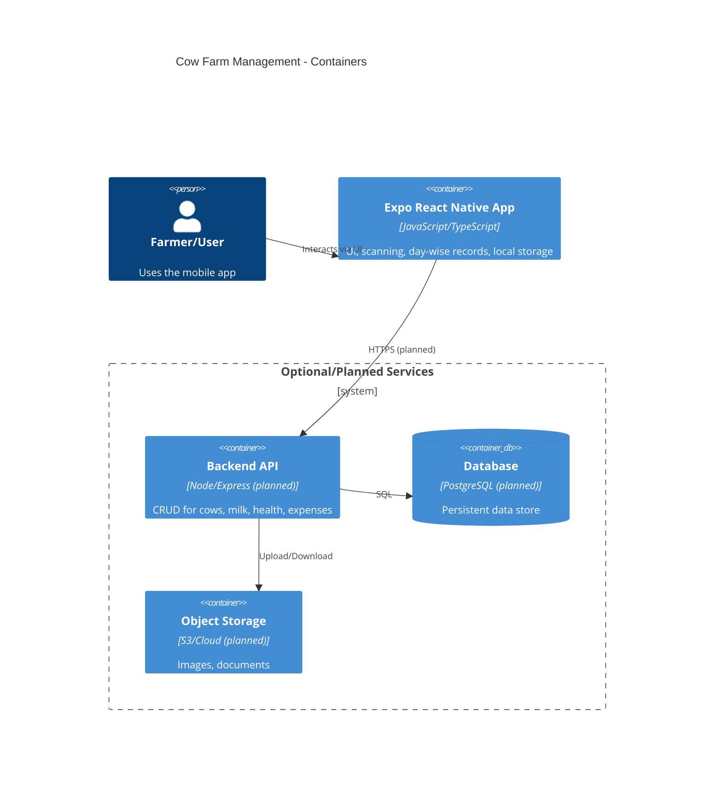
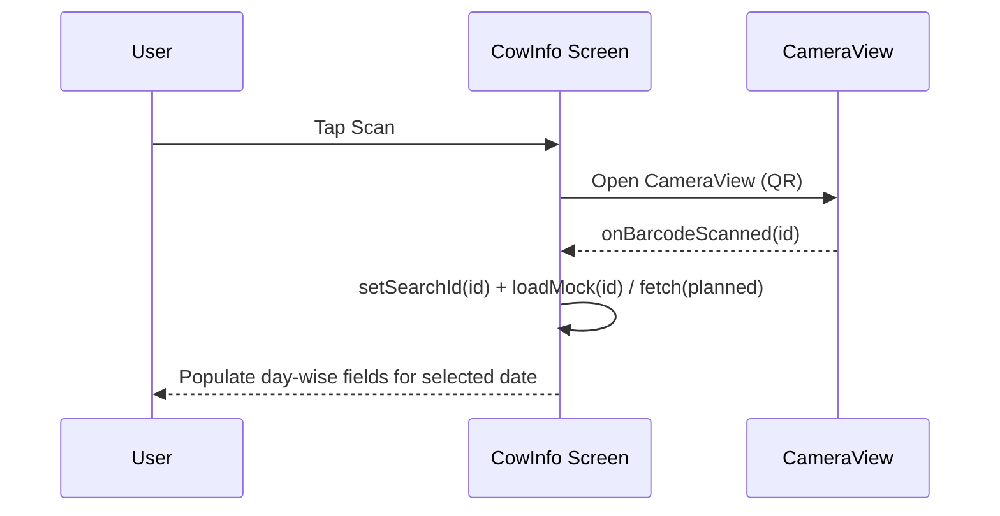
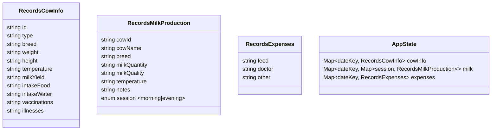

## System Architecture (Mermaid)

Below are Mermaid diagrams describing the current architecture and core flows of the Cow Farm Management app (Expo/React Native). You can paste these in any Mermaid-enabled viewer.

### High-Level Container Diagram


### App Module Overview
```mermaid
flowchart TB
  subgraph Expo_App[Expo React Native App]
    UI_Home[Home Dashboard]
    UI_Reg[Cow Registration]
    UI_Info[Cow Information (day-wise)]
    UI_Milk[Milk Production (AM/PM, day-wise)]
    UI_Exp[Expenses (day-wise)]
    Cam[expo-camera / CameraView]
    Router[expo-router]
    State[Local State (useState)]
    Storage[(Planned AsyncStorage)]
  end

  UI_Home -->|navigate| Router
  Router --> UI_Reg
  Router --> UI_Info
  Router --> UI_Milk
  Router --> UI_Exp

  Cam --> UI_Info
  Cam --> UI_Milk

  State --> UI_Info
  State --> UI_Milk
  State --> UI_Exp

  Storage -. planned sync .-> State
```

### QR Scan to Cow Info (Sequence)


### Day-wise Entry Logic (Shared Pattern)
```mermaid
flowchart LR
  DateSel[Date Selector (Prev/Next/Today)] --> Key[Compute dateKey (YYYY-MM-DD)]
  Key --> Records{records[dateKey] exists?}
  Records -- No --> Init[Initialize empty object]
  Records -- Yes --> Bind[Bind inputs to records[dateKey]]
  Inputs[UI Inputs] --> Update[updateRecord(field, value)] --> Save[In-memory (planned: AsyncStorage)]
```

### Data Shapes (In-App State)


### Optional Future Backend (CRUD)
```mermaid
flowchart TB
  App[Expo App] -->|HTTPS| API[REST API (planned)]
  API --> DB[(SQL DB)]
  API --> OBJ[(Object Storage)]
  subgraph Entities
    Cow[(Cow)]
    Milk[(MilkEntry)]
    Health[(HealthRecord)]
    Exp[(ExpenseEntry)]
  end
  API <---> Cow
  API <---> Milk
  API <---> Health
  API <---> Exp
```

Notes:
- Current implementation keeps data in memory; persistence can be added via `AsyncStorage`.
- Scanning uses `expo-camera`'s `CameraView` with `onBarcodeScanned` and permission hook.
- Navigation is managed by `expo-router` with stack screens per feature.


